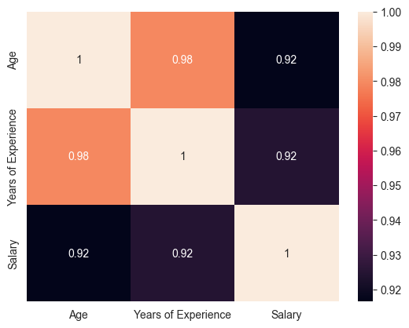
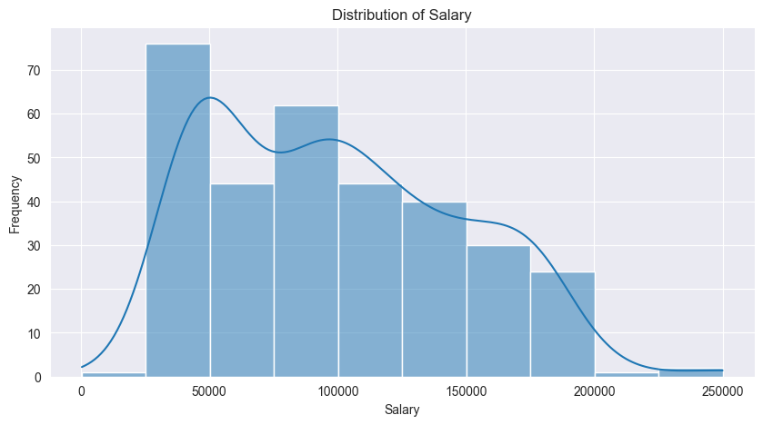
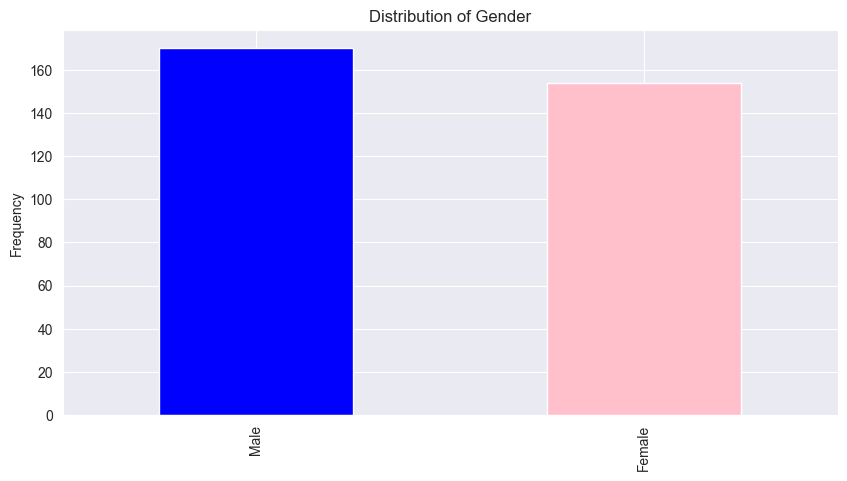
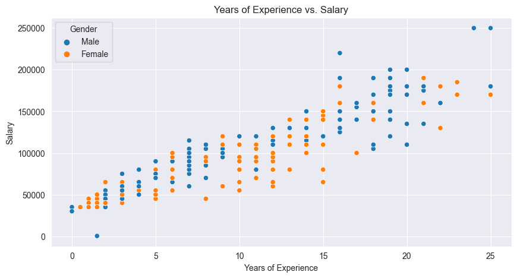
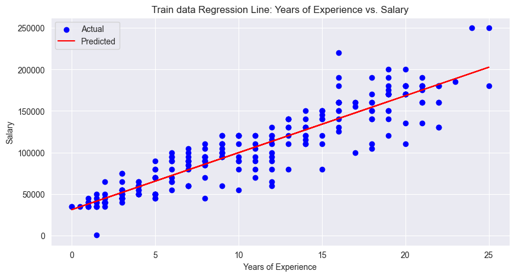

# ML-Regression-Analysis

### Project 1 (Analiza e te dhenave/Regresi linear/shumefishte/logjik)

Analiza e rrogave të punonjësve ne bazë të eksperiencës së tyre.

1 - Eksplorimi i te dhenave:

- Lexoni te dhenat
- Paraqisni te dhenat ne menyre te permbledhur(kolonat, rreshtat,
  llojet e te dhenave)
- Pastroni te dhenat nga dopiot, te dhenat boshe, lloji i te dhenave
- Llogarisni disa statistika permbledhese.

```python
import pandas as pd

# I lexojn te dhenat nga dataseti
# ky dataset eshte marre nga kaggle.com (https://www.kaggle.com/datasets/rkiattisak/salaly-prediction-for-beginer)
df = pd.read_csv("Salary_Data.csv")

df.head()
```

<div>
<style scoped>
    .dataframe tbody tr th:only-of-type {
        vertical-align: middle;
    }

    .dataframe tbody tr th {
        vertical-align: top;
    }

    .dataframe thead th {
        text-align: right;
    }

</style>
<table border="1" class="dataframe">
  <thead>
    <tr style="text-align: right;">
      <th></th>
      <th>Age</th>
      <th>Gender</th>
      <th>Education Level</th>
      <th>Job Title</th>
      <th>Years of Experience</th>
      <th>Salary</th>
    </tr>
  </thead>
  <tbody>
    <tr>
      <th>0</th>
      <td>32.0</td>
      <td>Male</td>
      <td>Bachelor's</td>
      <td>Software Engineer</td>
      <td>5.0</td>
      <td>90000.0</td>
    </tr>
    <tr>
      <th>1</th>
      <td>28.0</td>
      <td>Female</td>
      <td>Master's</td>
      <td>Data Analyst</td>
      <td>3.0</td>
      <td>65000.0</td>
    </tr>
    <tr>
      <th>2</th>
      <td>45.0</td>
      <td>Male</td>
      <td>PhD</td>
      <td>Senior Manager</td>
      <td>15.0</td>
      <td>150000.0</td>
    </tr>
    <tr>
      <th>3</th>
      <td>36.0</td>
      <td>Female</td>
      <td>Bachelor's</td>
      <td>Sales Associate</td>
      <td>7.0</td>
      <td>60000.0</td>
    </tr>
    <tr>
      <th>4</th>
      <td>52.0</td>
      <td>Male</td>
      <td>Master's</td>
      <td>Director</td>
      <td>20.0</td>
      <td>200000.0</td>
    </tr>
  </tbody>
</table>
</div>
```

```python
df.info()
```

- 0 Age 373 non-null float64
- 1 Gender 373 non-null object
- 2 Education Level 373 non-null object
- 3 Job Title 373 non-null object
- 4 Years of Experience 373 non-null float64
- 5 Salary 373 non-null float64
- dtypes: float64(3), object(3)
- memory usage: 17.7+ KB

Nga kjo informacion mund te shohim qe dataseti ka 2 kolona dhe 30
rreshta. Kolonat jane:

- YearsExperience
- Salary
- City
- Language
- Level

Duke pare te dhenat, mund te shohim qe kolonat \'City\', \'Language\'
dhe \'Level\' kane te dhena te tipit string, ndersa kolonat
\'YearsExperience\' dhe \'Salary\' kane te dhena te tipit float.

Ne kete rast Salari eshte variabla e varur, ndersa YearsExperience eshte
variabla e pavarur. Nese deshirojm të përdorim Multilinear Regression,
atëherë Age do të jetë variabla e pavarur

```python
#Funksioni per te hequr outlinerat nga dataseti
def drop_outliers(df, column_name):
    percent = 1.5

    q1 = df[column_name].quantile(0.25)
    q3 = df[column_name].quantile(0.75)

    iqr = q3 - q1

    lower_bound = q1 - percent * iqr
    upper_bound = q3 + percent * iqr

    df_no_outliers = df[(df[column_name] >= lower_bound) & (df[column_name] <= upper_bound)]

    return df_no_outliers
```

```python
# Pastrimi i te dhenave

df = df.dropna()  # I heqim te gjitha rreshtat qe jane null
df = df.drop_duplicates()  # I heqim te gjitha rreshtat qe jane duplikate

# I heqim outlinerat
df = drop_outliers(df, 'Years of Experience')
df = drop_outliers(df, 'Salary')

```

```python
# I vizualizojme te dhenat e pastruara permes grafikeve
import matplotlib.pyplot as plt

# Sekotri per Multilinear Regression
# entry = ['Education Level', 'Job Title']
#
# for col in entry:
#     df[col] = df[col].astype('category')
#     df[col] = df[col].cat.codes
# X = df.drop(columns=['Age', 'Gender', 'Salary'])

# Nje scatter graf i thjesht per te pare se me cfare dhena kemi pas pastrimit te tyre
X = df['Years of Experience']
y = df['Salary']

plt.scatter(X, y)
```

```python
# Llogarisim disa statistika permbledhese
df.describe()
```

<div>
<style scoped>
    .dataframe tbody tr th:only-of-type {
        vertical-align: middle;
    }

    .dataframe tbody tr th {
        vertical-align: top;
    }

    .dataframe thead th {
        text-align: right;
    }

</style>
<table border="1" class="dataframe">
  <thead>
    <tr style="text-align: right;">
      <th></th>
      <th>Age</th>
      <th>Years of Experience</th>
      <th>Salary</th>
    </tr>
  </thead>
  <tbody>
    <tr>
      <th>count</th>
      <td>324.000000</td>
      <td>324.000000</td>
      <td>324.000000</td>
    </tr>
    <tr>
      <th>mean</th>
      <td>37.382716</td>
      <td>10.058642</td>
      <td>99985.648148</td>
    </tr>
    <tr>
      <th>std</th>
      <td>7.185844</td>
      <td>6.650470</td>
      <td>48652.271440</td>
    </tr>
    <tr>
      <th>min</th>
      <td>23.000000</td>
      <td>0.000000</td>
      <td>350.000000</td>
    </tr>
    <tr>
      <th>25%</th>
      <td>31.000000</td>
      <td>4.000000</td>
      <td>55000.000000</td>
    </tr>
    <tr>
      <th>50%</th>
      <td>36.500000</td>
      <td>9.000000</td>
      <td>95000.000000</td>
    </tr>
    <tr>
      <th>75%</th>
      <td>44.000000</td>
      <td>16.000000</td>
      <td>140000.000000</td>
    </tr>
    <tr>
      <th>max</th>
      <td>53.000000</td>
      <td>25.000000</td>
      <td>250000.000000</td>
    </tr>
  </tbody>
</table>
</div>
```
Ketu mund te shohim vlerat permes statistikave permbledhese per kolonat
\'Years of Experience\' dhe \'Salary\' ku kemi 324 vlera te ndryshme per
\'Years of Experience\' dhe 324 vlera te ndryshme per \'Salary\' Ktu
shohim se rroga mesatare e nje puntori eshte 99985.64 Dollar.

Rroga Maksimale eshte 250000 Dollar me 25 vjet eksperience

```python
import seaborn as sns

# duke perdorur seaborn e bejm grafin e heatmap
sns.heatmap(df.corr(), annot=True)
plt.show()
```



```python
# pairplot per te pare te gjitha krahasimet e mundshme qe i kemi
sns.pairplot(df)
```


3 - Analizoni marredhenien midis dy variablave ne te njejten kohe me ane
te paraqitje grafike.

```python
plt.figure(figsize=(10, 5))
sns.histplot(df['Salary'], kde=True, bins=10)
plt.title("Distribution of Salary")
plt.xlabel("Salary")
plt.ylabel("Frequency")
plt.show()
```



```python
plt.figure(figsize=(10, 5))
sns.boxplot(df['Salary'])
plt.title("Boxplot of Salary")
plt.show()
```


```python
# sa mashkuj dhe femra kemi
plt.figure(figsize=(10, 5))
df['Gender'].value_counts().plot(kind='bar', color=['blue', 'pink'])
plt.title("Distribution of Gender")
plt.ylabel("Frequency")
plt.show()
```



```python
# Scatterplot for relationships
plt.figure(figsize=(10, 5))
sns.scatterplot(x='Years of Experience', y='Salary', data=df, hue='Gender')
plt.title("Years of Experience vs. Salary")
plt.xlabel("Years of Experience")
plt.ylabel("Salary")
plt.show()
```



4- Analiza e korrelacionit/regresionit:

- Ndertoni nje model regresioni
- Paraqitja grafike
- Shpjegoni perfundimin

```python
# Correlation matrix
corr_matrix = df.select_dtypes(include=['int64', 'float64']).corr()
plt.figure(figsize=(8, 6))
sns.heatmap(corr_matrix, annot=True, cmap='coolwarm', fmt='.2f')
plt.title("Correlation Matrix")
plt.show()
```


#### Ndertimi i modelit te regresionit

```python
from sklearn.linear_model import LinearRegression
from sklearn.model_selection import train_test_split

X = df[['Years of Experience']]  # variabla e varur
y = df['Salary']  # variabla e pavaur

# ndajme te dhenat ne te dhenat e trajnuara dhe te testuara
X_train, X_test, y_train, y_test = train_test_split(X, y, test_size=0.2, random_state=42)

# Simple Linear Regression Model
model = LinearRegression()
model.fit(X_train, y_train)

# I parashikojm te dhenat e testuara dhe te trajnuara
y_train_pred = model.predict(X_train)  # y = mx + c
y_test_pred = model.predict(X_test)

# b1 = model.coef_
# b0 = model.intercept_
# print(b1)
# print(b0)
#
# y_pred_test = b0 + b1 * x_test
```

```python
# nje funksion per te shfaqur percentin e nje vlere
def percent_of(value):
    print(f"({round(value, 4) * 100}%)")
```

### Performaca e modelit ne te dhenat e trajnuara

```python
plt.figure(figsize=(10, 5))
plt.scatter(X_test, y_test, color='blue', label='Actual')
plt.plot(X_test, y_test_pred, color='red', label='Predicted')
plt.title("Test data Regression Line: Years of Experience vs. Salary")
plt.xlabel("Years of Experience")
plt.ylabel("Salary")
plt.legend()
plt.show()

from sklearn.metrics import r2_score

# r2 dhe model score duhen te ken nje vlere te njejte
percent_of(model.score(X_test, y_test))
r2 = r2_score(y_test, y_test_pred)
print(f"R^2 Score: {r2:.2f}")
```


(85.02%)
R^2 Score: 0.85

### Performanca e modelit ne te dhenat e trajnuara

```python
plt.figure(figsize=(10, 5))
plt.scatter(X_train, y_train, color='blue', label='Actual')
plt.plot(X_train, y_train_pred, color='red', label='Predicted')
plt.title("Train data Regression Line: Years of Experience vs. Salary")
plt.xlabel("Years of Experience")
plt.ylabel("Salary")
plt.legend()
plt.show()

from sklearn.metrics import r2_score

# r2 dhe model score duhen te ken nje vlere te njejte
percent_of(model.score(X_train, y_train))
r2 = r2_score(y_train, y_train_pred)

print(f"R^2 Score: {r2:.2f}")
```



(85.49%)
R^2 Score: 0.85

```python
# Shpjegimi i perfundimit

print("Test data results:")
print(f"Accuracy: {model.score(X_test, y_test)}")
print("-------------------------------------------------")

print("Train data results:")
print(f"Accuracy: {model.score(X_train, y_train)}")

# Nga rezultatet e marra, mund te konkludojme se modeli i ndertuar ka nje performace te mire ne te dhenat e testuara dhe te trajnuara rreth 85% korrektesi.
```

Test data results:
Accuracy: 0.850152763634785

---

Train data results:
Accuracy: 0.8548624651340639
